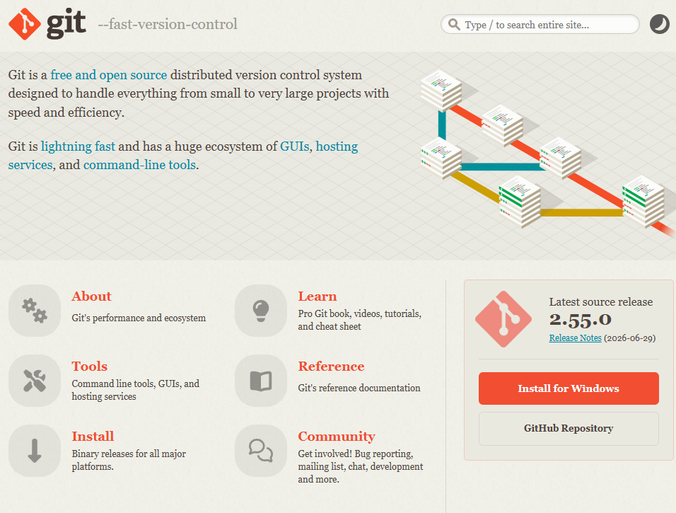
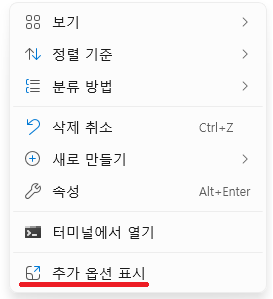
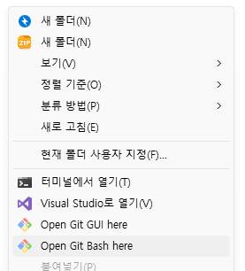
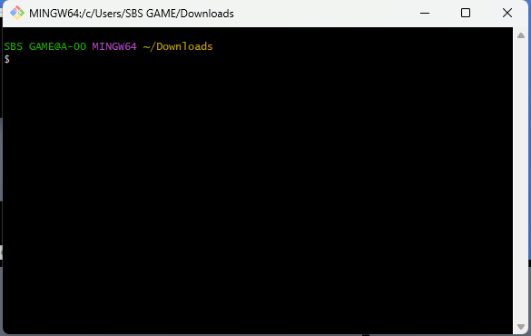

# Chapter 0 빠른 실습으로 Git, GitHub 감 익히기

## 학습 목표

- 파일 덮어쓰기·메일로 폴더를 주고받던 불편과, Git이 그 문제를 어떻게 줄이는지 말할 수 있다.
- Git과 GitHub의 역할 차이를 말로 구분할 수 있다.
- 내 PC에서 저장소를 만들고 커밋까지 수행할 수 있다.
- 원격과 연결해 푸시·풀·클론의 흐름을 따라 할 수 있다.

## 본문

### 0-1 왜 Git이 필요할까

여러 사람이 같은 게임·프로그램 파일을 고친다고 상상해 보세요. Git이 없던 시절에는 흔히 **완성본 폴더를 USB나 이메일로 주고받거나**, `최종`, `최종_진짜`, `최종_진짜_최종`처럼 **파일 이름을 바꿔 가며** 보관했습니다. 그러면 누가 무엇을 고쳤는지 알기 어렵고, 한쪽이 옛 파일로 덮어쓰면 다른 사람의 작업이 **통째로 사라질** 수 있습니다. “어제 잘 돌아가던 상태로 되돌리고 싶다”도 어렵습니다.

그래서 사람들은 이렇게 해결하고 싶어 했습니다.

1. **지금 이 폴더의 상태를, 날짜·메시지와 함께 한 기록으로 남긴다.** 나중에 그 시점으로 돌아갈 수 있게 한다.
2. **각자 컴퓨터에도 그 기록의 복사본을 둔다.** 인터넷이 잠깐 없어도 기록을 이어 가고, 나중에 서로 맞춘다.
3. **공유용 자리를 하나 둔다.** 팀원이 올린 최신 기록을 받아 오거나, 내 기록을 올려 맞출 수 있게 한다.

그 일을 내 PC에서 해주는 **프로그램**이 **Git**입니다.  
Git으로 만든 기록을 **인터넷에 올려 두고**, 브라우저에서 보고·다운로드받고·함께 맞추게 해 주는 **웹 서비스**가 **GitHub**입니다. GitLab·Bitbucket도 같은 역할을 하는 웹 서비스입니다.


| 구분     | Git             | GitHub               |
| ------ | --------------- | -------------------- |
| 어디에 있나 | 내 PC에 설치하는 프로그램 | 웹사이트                 |
| 하는 일   | 폴더 상태를 기록으로 남김  | 그 기록을 올려 두고 팀이 공유·백업 |


Git은 폴더 상태를 **기록**으로 남깁니다. 통째로 기록해 남겨 둔 모습을 사진에 비유해 **스냅샷**이라고도 부릅니다. 오프라인에서도 기록을 이어 갈 수 있고, 나중에 다른 컴퓨터에 저장된 기록을 확인해 그 컴퓨터에서 수정된 폴더나 파일의 내용을 내 폴더나 파일에 자동으로 합칠 수 있습니다.

git을 설치하는 링크는 [https://git-scm.com/](https://git-scm.com/) 입니다.



윈도우 기준으로 git을 설치하면 프로젝트 폴더에 우클릭 후 **Open Git Bash here** 이라는 옵션을 확인할 수 있는데, 이것을 눌러서 git을 사용할 수 있는 cli 환경을 실행할 수 있습니다.







이 환경에서는 리눅스 명령어와 함께 git을 사용할 수 있습니다. 또는 명령 프롬프트에서 MS-DOS 명령어와 함께 git을 사용해도 좋습니다.

---

### 0-2 로컬 저장소에서 커밋 관리하기

**저장소**는 Git이 기록을 붙인 **작업용 폴더**를 부르는 말입니다. `git init`을 실행하면 그 폴더 안에 `.git`이라는 숨김 폴더가 생기고, 이후 기록이 이 폴더 안에 쌓입니다. 

**커밋**은 “지금 이 폴더 상태를 메시지와 함께 **기록으로 남긴다**”는 동작입니다. 앞에서 말한 스냅샷을 **실제로 만듭니다.**

커밋으로 스냅샷을 남기기 전에, 스냅샷에 담을 파일을 골라 두는 단계가 있습니다. 그 고르는 동작을 **`git add`**, 골라 둔 뒤 시점을 확정하는 동작을 **`git commit`**이라고 합니다.


| 용어        | 의미                  |
| --------- | ------------------- |
| 작업 폴더     | 지금 편집하는 파일들이 있는 폴더  |
| `git add` | 다음 커밋에 넣을 파일·변경을 고름 |
| 커밋        | 고른 내용을 한 시점으로 기록함   |


아래 명령을 위에서부터 순서대로 실행해 첫 저장소와 첫 커밋을 만들어 보세요. 

**주의** : 반드시 본인의 프로젝트 폴더에서 명령어를 실행하세요. `git init`을 실행해서 `.git`가 생기면 git은 `.git`가 존재하는 폴더의 모든 파일을 git에 추가할 대상 파일로 인식합니다.

```bash
git init
git add 본인의파일이름.확장자
git commit -m "add txt"
```

**명령어 해석.** `git init`이 현재 폴더를 저장소로 만듭니다. `git add`로 `본인의파일이름.확장자` 파일을 고른 뒤, `git commit`으로 첫 스냅샷을 남깁니다. `-m` 뒤 글자는 이 기록에 붙는 짧은 메모입니다.

커밋 뒤 `git status`를 치면, 지금 폴더에 **아직 남기지 않은 변경이 있는지**를 알려 줍니다. 모두 남겨 두었으면 “nothing to commit” 같은 문구가 나옵니다. `git log`는 **커밋 기록**을 위에서 아래로 보여 줍니다.

---


### 0-3 GitHub에 커밋 올리기

`0-1`에서 말한 **공유용 자리**가 GitHub입니다. 내 PC에만 있는 커밋을 팀에 나누려면, 먼저 GitHub에 **빈 저장소**를 만들고, 그 주소에 내 기록을 **올려**야 합니다.

브라우저에서 GitHub에 로그인한 뒤, 새 저장소를 만듭니다. 저장소 이름은 나중에 기억하기 쉬운 것으로 정합니다. 지금은 **README를 자동으로 만들지 않은 빈 저장소**로 두면, 방금 `0-2`에서 만든 내 PC 저장소와 맞추기 쉽습니다.


저장소를 만들면 GitHub가 **주소**를 보여 줍니다. 이 장에서는 **HTTPS** 주소만 복사합니다. SSH는 나중에 배워도 됩니다.


**원격**은 “인터넷 쪽에 있는 저장소”를 가리키는 말입니다. 처음 연결한 원격에는 보통 **`origin`**이라는 이름을 붙입니다.  
**푸시**는 내 PC에 쌓인 커밋을 그 원격으로 **올리는** 동작입니다.

| 용어 | 의미 |
|------|------|
| 원격 | 인터넷에 있는 저장소 |
| `origin` | 내가 붙인 첫 원격의 흔한 이름 |
| 푸시 | 내 커밋을 원격으로 올림 |

**주의:** 아래 명령의 `USER`와 `REPO`는 **본인 GitHub 계정 이름**과 **방금 만든 저장소 이름**으로 바꿉니다. `0-2`에서 `git init`을 한 **그 프로젝트 폴더**의 Git Bash에서 실행하세요.

```bash
git remote add origin https://github.com/USER/REPO.git
git branch -M main
git push -u origin main
```

예상 결과:

```text
Enumerating objects: 3, done.
...
To https://github.com/USER/REPO.git
 * [new branch]      main -> main
```

**명령어 해석.** `git remote add origin …`은 복사한 주소에 `origin`이라는 이름을 붙입니다. `git branch -M main`은 지금 쓰는 기록 줄 이름을 `main`으로 맞춥니다. `git push -u origin main`이 그 줄의 커밋을 올립니다. `-u`는 이후 `git push`만 쳐도 같은 원격을 쓰도록 기억하는 설정입니다. 처음 올릴 때 로그인을 물으면, 화면 안내대로 계정으로 들어가면 됩니다.

브라우저에서 GitHub 저장소 페이지를 새로고침하면, 올린 파일이 보이는지 확인합니다.


---

### 0-4 GitHub 기록을 내 PC로 받기

다른 PC에서 프로젝트를 **처음** 받을 때는 **클론**을 씁니다. `git clone`은 GitHub에 있는 기록 전체를 **새 폴더로 복사**합니다. 복사본 안에는 `.git`도 함께 옵니다.

이미 `0-2`·`0-3`으로 연결해 둔 폴더에서, 팀원이 올린 **최신 커밋**만 가져올 때는 **풀**을 씁니다. `git pull`은 원격의 새 기록을 가져와 **지금 쓰는 폴더에 반영**합니다.

| 명령 | 언제 쓰나 |
|------|-----------|
| `git clone` | 프로젝트를 이 PC에 처음 받을 때 |
| `git pull` | 이미 있는 폴더에 원격의 새 커밋을 반영할 때 |

입문에서는 위 두 가지만 구분하면 됩니다. 원격만 먼저 보고 합치기는 나중에 하는 흐름은 뒤 장에서 이어집니다.

**주의:** `USER`와 `REPO`는 본인 값으로 바꿉니다. 클론은 **새 폴더가 생겨도 되는 위치**에서 실행하세요. 이미 `git init`을 한 폴더 안에서 같은 저장소를 다시 클론하지 않습니다.

```bash
git clone https://github.com/USER/REPO.git
cd REPO
git pull
```

예상 결과:

```text
Already up to date.
```

원격에 새 커밋이 없을 때 위와 같이 나옵니다. 새 커밋이 있으면 받아 온 파일·줄 수가 짧게 출력됩니다.

**명령어 해석.** `git clone`은 주소의 저장소를 새 폴더로 통째로 복사합니다. `cd REPO`로 그 폴더로 들어간 뒤, `git pull`은 이미 최신이면 위처럼 알려 주고, 새 커밋이 있으면 가져와 폴더에 반영합니다.

### 연습문제

**문제 1**

- 문제: Git이 없을 때 생기던 불편 한 가지와, Git이 그 불편을 줄이는 방식을 각각 한 문장으로 쓰세요.
- 입력: 없음
- 출력: 불편 1문장 + 해결 방향 1문장
- 조건: `0-1`의 덮어쓰기·시점 기록·각자 복사 이야기만으로 답할 것

**문제 2**

- 문제: Git과 GitHub 중 “내 노트북에서만 시점 기록을 남기는 데 필수”인 것을 고르고, 이유를 한 문장으로 쓰세요.
- 입력: 없음
- 출력: Git을 지목하는 한 문장
- 조건: `0-1` 표의 역할 구분만으로 답할 것

**문제 3**

- 문제: 본인 프로젝트 폴더에서 파일 하나를 수정한 뒤, `git add`와 `git commit`으로 기록을 남기세요. 커밋 메시지는 바꾼 내용을 짧게 적습니다.
- 입력: 수정한 본인 파일
- 출력: `git log`에 새 커밋이 보임. `git status`에서 커밋할 변경 없음
- 조건: **본인 프로젝트 폴더**에서 실행. `git add` 후 `git commit` 순서를 지킬 것

### 정답 포인트

- 문제 1: 예) 메일·이름 바꿔 덮어쓰기 사고 → 시점마다 기록·각자 PC에 복사본을 둠
- 문제 2: 시점 기록 자체는 Git. 올려 두고 공유하는 자리는 GitHub 등
- 문제 3: 변경은 **`add`로 고른 뒤 `commit`으로 스냅샷을 남김**. `0-2`와 같은 폴더·순서
- 공통: 용어보다 **왜 남기는지**를 먼저 말할 수 있으면 `0-1` 목표를 달성한 것

---

[상위 문서로 돌아가기](./README.md)