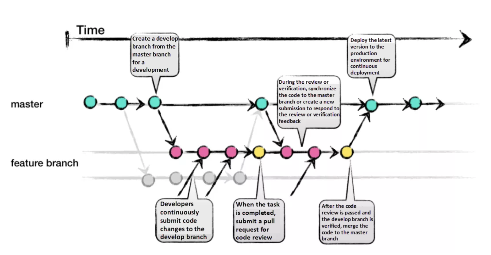

# Chapter 11 GitHub Flow로 배포 가능한 main 만들기

## 학습 목표

- **GitHub Flow**가 말하는 **브랜치 → 커밋·푸시 → PR(Pull Request, 풀 리퀘스트) → 검토 → 병합 → 브랜치 삭제** 순서를 끝까지 말할 수 있다.
- 기본 브랜치(보통 `main`)를 **직접 건드리지 않고** 작업 공간을 나누는 이유와, PR에서 **리뷰·상태 검사(CI)**를 거치는 이유를 설명한다.
- **한 브랜치·한 PR**에 담을 변경의 크기를 어떻게 잡으면 검토·되돌리기가 쉬운지 말로 정리한다.

## 세부 주제

- GitHub Flow의 목적과 전제(계정·저장소)
- 브랜치 만들기: 기본 브랜치와 분리된 작업 공간
- 변경 적용·커밋·푸시: 메시지·단위 커밋·원격 백업
- Pull Request 만들기: 초안·본문·이슈 연결·검사
- 검토 의견 반영하기
- Pull Request 병합하기: 충돌·브랜치 보호
- 병합 후 브랜치 삭제하기 및 GitLab Flow·Git Flow와의 연결(안내)

## 실습 체크리스트

- GitHub에 **테스트용 저장소**를 두고, **브랜치 생성 → 로컬에서 커밋·푸시 → PR 생성 → 리뷰(또는 셀프 코멘트) 반영 → `main` 병합 → 원격 브랜치 삭제**까지 한 번 완주한다.
- [Chapter 3](./03-collaboration-sourcetree.md)의 브랜치·병합 감각과 맞춰 보며, 이번에는 **반드시 PR 화면**을 거치도록 한다.
- 저장소에 **상태 검사**(예: 간단한 CI)가 있다면, PR에서 통과·실패가 어떻게 보이는지 확인한다. 설정 요약은 [Chapter 6](./06-github-features.md)을 참고한다.

## 본문

<a id="ch11-1"></a>

### 11-1 GitHub Flow란 무엇인가

**GitHub Flow**는 **짧은 분기(브랜치)**를 중심으로 한 **단순한 협업 워크플로**입니다. 코드뿐 아니라 문서·정책·기획처럼 GitHub에 올린 자료를 여럿이 고칠 때도 같은 순환을 씁니다. 흐름을 따르려면 **GitHub 계정**과 **작업할 저장소**(직접 만든 저장소이거나 기여할 수 있는 권한이 있는 저장소)가 있으면 됩니다. 첫 설정은 [Chapter 0](./00-quickstart.md)·[Chapter 6](./06-github-features.md)과 맞춰 보면 좋습니다.

각 단계는 **웹 UI**, **터미널(Git)**, **GitHub Desktop** 등 익숙한 도구로 진행할 수 있습니다. 중요한 것은 **도구가 아니라 순서와 역할 분담**입니다. **브랜치 전략**을 처음 접한다면 [Chapter 10](./10-branch-strategy-overview.md)에서 **용어와 전략 종류·챕터 연결**을 짚고 오면 이 장이 더 수월합니다.

아래 그림은 **기본 브랜치**와 **기능 브랜치**를 오가며 PR로 합치는 흐름을 한눈에 보여 줍니다.



---

<a id="ch11-2"></a>

### 11-2 브랜치 만들기

저장소에서 **새 브랜치**를 만듭니다. 이름은 **짧고 무엇을 하는지 드러나게** 짓는 것이 좋습니다. 예를 들어 `increase-test-timeout`, `add-code-of-conduct`처럼 **동사·목적**이 보이면 협력자가 한눈에 파악하기 쉽습니다. 브랜치를 쓰면 **기본 브랜치**(보통 `main`)에 바로 손대지 않고도 작업할 공간이 생깁니다. 기본 브랜치는 **항상 배포하거나 공유해도 되는 기준선**으로 두려는 팀이 많고, GitHub Flow는 그 전제와 잘 맞습니다. 협력자는 브랜치 이름과 PR만으로 **지금 진행 중인 작업**을 구분할 수 있어 질문과 리뷰 시점을 맞추기 쉽습니다.

예시 명령(로컬에서 기본 브랜치를 최신으로 맞춘 뒤, 새 브랜치):

```bash
git checkout main
git pull origin main
git checkout -b fix-login-validation
```

**명령 해석.** `checkout -b`는 **지금 위치를 기준으로** 새 브랜치를 만들고 그 위로 옮깁니다. 브랜치 이름은 팀 규칙이 있으면 그에 따릅니다.

---

<a id="ch11-3"></a>

### 11-3 변경을 적용하고 커밋·푸시하기

만든 브랜치에서 **파일을 추가·수정·삭제**합니다. 브랜치 안에서는 실수해도 **기본 브랜치에는 반영되지 않으므로** 되돌리기·추가 커밋으로 수습할 여지가 큽니다. **병합이 끝나기 전까지** 변경은 그 브랜치(와 PR)에만 남습니다. **커밋마다** 무엇을 바꿨는지 **한눈에 보이는 메시지**를 다는 습관이 좋습니다(예: `fix typo`, `increase rate limit`). **한 커밋에는 한 덩어리의 완결된 변경**을 넣는 편이 이후에 **특정 커밋만 되돌리기** 쉽습니다. “변수 이름 변경”과 “테스트 추가”를 **한 커밋에 몰아넣으면**, 나중에 변수 이름만 되돌리고 테스트는 남기기 어렵기 때문에 **나눌 수 있으면 커밋을 나눕니다.**

**자주 하는 실수**로, 서로 **관련 없는 수정**(예: 오타 수정과 기능 추가)을 **같은 브랜치**에 계속 쌓으면 PR이 비대해지고 리뷰어가 피드백하기 어렵습니다. 한쪽 변경이 지연될 때 다른 쪽까지 **머지가 막히는** 일도 잦으므로, **변경 묶음마다 브랜치를 나누는** 편이 안전합니다. 변경을 **커밋하고 원격에 푸시**하면 작업이 **원격에 백업**되고, 다른 PC에서 이어 하거나 협력자가 **같은 브랜치**를 볼 수 있습니다. 피드백을 받을 준비가 될 때까지 **같은 브랜치에 추가 커밋·푸시**를 반복해도 됩니다.

예시 명령:

```bash
git add .
git commit -m "Validate login form on submit"
git push -u origin fix-login-validation
```

**명령 해석.** 첫 푸시에 `-u`(upstream)를 쓰면 이후 `git push`만으로 같은 브랜치로 올릴 수 있습니다.

---

<a id="ch11-4"></a>

### 11-4 Pull Request 만들기

**PR(Pull Request, 풀 리퀘스트)**은 “이 브랜치의 변경을 기본 브랜치에 합쳐도 될지”를 **검토·토론**하는 자리입니다. 협력자에게 **피드백을 요청**할 때 열며, 저장소마다 **병합 전 승인 리뷰가 필수**인 경우도 많아 PR은 품질 관문이 됩니다. 변경을 다 덜 마쳤어도 **초안(Draft) PR**으로 먼저 열어 **초기 의견**을 받는 팀도 있습니다.

PR **본문**에는 **무엇을 바꿨는지**, **어떤 이슈·작업과 연결되는지**를 요약합니다. 표·이미지로 설명하면 리뷰가 빨라집니다. 이슈와 연결해 두면 **키워드**를 쓰는 저장소 규칙에 따라 **병합 시 이슈가 자동으로 닫히기**도 합니다(저장소의 이슈·PR 연결 규칙을 따릅니다). **특정 줄**에 코멘트를 달아 검토자에게 짚어 줄 수 있고, **리뷰어를 지정**하거나 본문에서 **@멘션**으로 부르는 방식도 흔합니다.

저장소에 **상태 검사**(**CI**, Continuous Integration의 약자, 한국어로는 “지속적 통합”. 여기서는 푸시·PR마다 자동으로 돌리는 빌드·테스트 등을 가리킴)를 연결해 두었다면, PR에 **실패한 검사**가 표시되어 **병합 전에 문제**를 잡기 쉽습니다.

---

<a id="ch11-5"></a>

### 11-5 검토 의견 처리하기

검토자는 **질문·의견·제안**을 PR 전체 또는 **파일·줄 단위**로 남깁니다. 이미지나 **코드 제안**으로 의도를 밝히기도 합니다. 작성자는 그에 맞춰 **브랜치에 추가 커밋을 만들고 푸시**하면 **같은 PR이 자동으로 갱신**되므로, 새 PR을 매번 열 필요는 없습니다.

---

<a id="ch11-6"></a>

### 11-6 Pull Request 병합하기

리뷰와 검사가 충분하면 **PR을 병합**합니다. 그러면 변경이 **기본 브랜치**에 반영되고, GitHub는 **PR·커밋 기록**을 남겨 나중에 **왜 이렇게 바뀌었는지** 추적하기 쉽게 합니다. GitHub는 **병합 충돌**이 있으면 해결할 때까지 병합이 어렵다고 알려 줍니다. 로컬에서 충돌을 풀고 푸시하는 흐름은 [Chapter 3](./03-collaboration-sourcetree.md)·[Chapter 8](./08-cli-branch.md)과 함께 보면 좋습니다. **브랜치 보호 규칙**(필요 승인 수, 특정 검사 통과 등)이 있으면 조건을 만족하지 않으면 **병합 버튼이 막힐** 수 있으며, 저장소 설정 개념은 [Chapter 6](./06-github-features.md)에서 다룹니다.

---

<a id="ch11-7"></a>

### 11-7 병합 후 브랜치 삭제하기

PR을 병합한 뒤에는 **원격의 기능 브랜치를 삭제**하는 것이 일반적입니다. **작업이 끝났다**는 신호가 되고, 누군가 **옛 브랜치로 실수로 푸시**하는 일도 줄입니다. 브랜치를 지워도 **PR과 커밋 기록은 사라지지 않습니다.** 필요하면 **삭제한 브랜치를 복원**하거나 PR을 기준으로 이력을 따라갈 수 있습니다.

GitHub Flow는 보통 **`develop` 같은 중간 기본 브랜치 없이** `main`과 **짧은 기능 브랜치**만으로 운영합니다. **환경 단계**를 브랜치로 더 드러내고 싶다면 [Chapter 12 GitLab Flow](./12-gitlab-flow.md)을, **릴리즈·핫픽스**를 길게 나누는 패턴은 [Chapter 13 Git Flow](./13-git-flow.md)을 참고합니다. 여러 전략을 한눈에 비교하면 [Chapter 14](./14-branch-comparison-fork-team-pr.md)입니다.

---

연습문제:

1. 문제: GitHub Flow에서 **“기본 브랜치에 직접 푸시만 하고 PR을 쓰지 않는”** 경우, 공식 흐름이 빠진 **검증·기록** 단계를 두 가지 이상 적으세요.
2. 문제: “관련 없는 변경은 브랜치를 나눈다”는 팁이 **리뷰 난이도**와 **배포 지연** 각각에 어떤 도움이 되는지 한 문장씩 설명하세요.
3. 문제: PR 병합 후 기능 브랜치를 삭제해도 **커밋 이력**이 남는 이유를, `main` 위치와의 관계로 한두 문장으로 설명하세요.

정답 포인트:

PR 없이 직접 푸시하면 **동료 리뷰·승인 절차·CI 게이트·PR 본문에 남는 합의 기록**이 빠지기 쉽습니다. 브랜치·PR을 작게 나누면 **리뷰 범위가 줄어들고**, 한 작업이 지연돼도 **다른 작업의 병합이 덜 막힙니다.** 병합된 커밋은 **기본 브랜치(및 저장소 객체 DB)**에 남고, PR 페이지는 **병합 기록과 토론**을 보존합니다. 브랜치 이름은 **참조일 뿐**이라 삭제해도 이력 전체가 사라지지는 않습니다.

---

[상위 문서로 돌아가기](./README.md)
