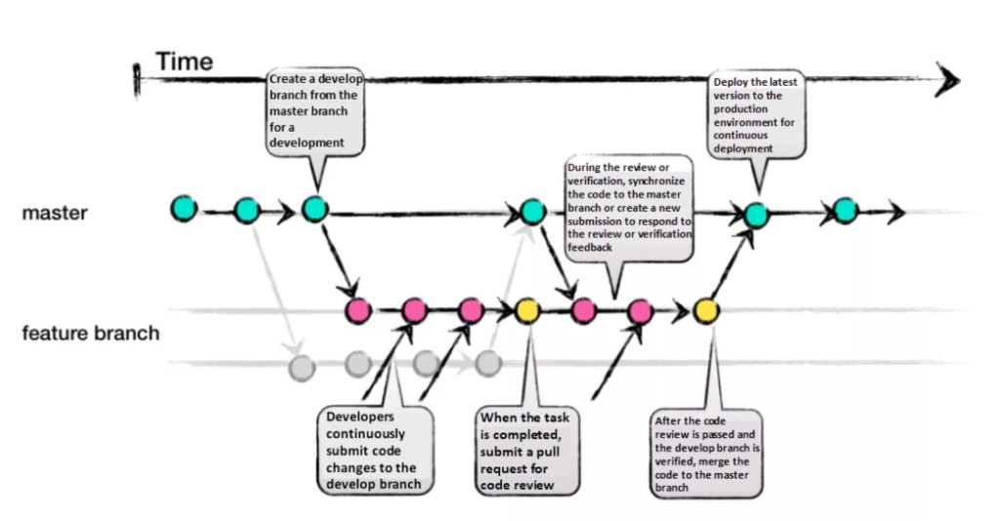

# Chapter 11 GitHub Flow로 배포 가능한 main 만들기

## 학습 목표
- **GitHub Flow**가 말하는 **브랜치 → 커밋·푸시 → PR → 검토 → 병합 → 브랜치 삭제** 순서를 끝까지 말할 수 있다.
- 기본 브랜치(보통 `main`)를 **직접 건드리지 않고** 작업 공간을 나누는 이유와, PR에서 **리뷰·상태 검사**를 거치는 이유를 설명한다.
- **한 브랜치·한 PR**에 담을 변경의 크기를 어떻게 잡으면 검토·되돌리기가 쉬운지 말로 정리한다.

## 본문

<a id="ch11-1"></a>
### 11-1 GitHub Flow란 무엇인가

**GitHub Flow**는 **짧은 기능 브랜치**를 중심으로 한 **단순한 협업 워크플로**입니다. 코드뿐 아니라 문서·정책처럼 GitHub에 올린 자료를 여럿이 고칠 때도 같은 순환을 씁니다. 흐름을 따르려면 **GitHub 계정**과 **작업할 저장소**가 있으면 됩니다. 첫 설정은 [Chapter 0](./00-quickstart.md)·[Chapter 6](./06-github-features.md)과 맞춰 보면 좋습니다.

**PR**은 Pull Request, 한국어로는 풀 리퀘스트입니다. “이 브랜치 변경을 기본 브랜치에 합쳐도 될지”를 검토하는 요청입니다. 각 단계는 웹 UI, 터미널 Git, GitHub Desktop 등 익숙한 도구로 진행할 수 있습니다. 중요한 것은 **도구가 아니라 순서와 역할 분담**입니다. 브랜치 전략 용어를 처음 접한다면 [Chapter 10](./10-branch-strategy-overview.md)에서 종류·챕터 연결을 짚고 오면 이 장이 더 수월합니다.

아래 그림은 기본 브랜치에서 기능 브랜치를 내어 작업하고, PR·리뷰 뒤에 다시 합치며 배포까지 이어지는 흐름을 한눈에 보여 줍니다. 도식에 `master`가 보이면, 실무에서는 보통 `main`이라고 읽으면 됩니다.



순서만 먼저 말해 보세요. **브랜치 만들기 → 커밋·푸시 → PR → 검토 → 병합 → 브랜치 삭제**입니다.

---

<a id="ch11-2"></a>
### 11-2 브랜치 만들기

저장소에서 **새 브랜치**를 만듭니다. 이름은 짧고 무엇을 하는지 드러나게 짓습니다. 예: `increase-test-timeout`, `add-code-of-conduct`. 브랜치를 쓰면 기본 브랜치 `main`에 바로 손대지 않고도 작업 공간이 생깁니다. 기본 브랜치는 **항상 배포하거나 공유해도 되는 기준선**으로 두려는 팀이 많고, GitHub Flow는 그 전제와 잘 맞습니다.

로컬에서 기본 브랜치를 최신으로 맞춘 뒤, 아래를 실행해 새 브랜치로 이동해 보세요.

```bash
git switch main
git pull origin main
git switch -c fix-login-validation
```

**예상 출력**

```text
Switched to a new branch 'fix-login-validation'
```

**명령 해석**
- `git switch main`과 `git pull`로 기준선을 맞춥니다.
- `git switch -c 이름`은 새 브랜치를 만들고 그쪽으로 옮깁니다. 팀 이름 규칙이 있으면 따릅니다.

---

<a id="ch11-3"></a>
### 11-3 변경을 적용하고 커밋·푸시하기

만든 브랜치에서 파일을 추가·수정·삭제합니다. 병합이 끝나기 전까지 변경은 그 브랜치와 PR에만 남습니다. 커밋마다 무엇을 바꿨는지 한눈에 보이는 메시지를 답니다. 한 커밋에는 한 덩어리의 완결된 변경을 넣는 편이, 나중에 특정 커밋만 되돌리기 쉽습니다.

**자주 하는 실수**는 관련 없는 수정을 같은 브랜치에 계속 쌓는 것입니다. PR이 커지고 리뷰가 어려워지며, 한쪽이 지연되면 다른 쪽 병합도 막힙니다. **변경 묶음마다 브랜치를 나누는** 편이 안전합니다. 커밋 후 원격에 푸시하면 백업이 되고, 협력자가 같은 브랜치를 볼 수 있습니다.

아래를 실행해 커밋하고 첫 푸시를 해보세요.

```bash
git add .
git commit -m "Validate login form on submit"
git push -u origin fix-login-validation
```

**명령 해석**
- `git add`·`git commit -m`은 앞 장에서 배운 로컬 기록입니다.
- 첫 푸시의 `-u`는 upstream 설정을 남겨, 이후 `git push`만으로 같은 브랜치에 올릴 수 있게 합니다.

---

<a id="ch11-4"></a>
### 11-4 Pull Request 만들기

PR은 협력자에게 피드백을 요청할 때 엽니다. 저장소마다 병합 전 승인 리뷰가 필수인 경우도 많아, PR은 품질 관문이 됩니다. 변경을 다 덜 마쳤어도 **초안 PR**로 먼저 열어 초기 의견을 받는 팀도 있습니다.

PR 본문에는 **무엇을 바꿨는지**, **어떤 작업과 연결되는지**를 요약합니다. 저장소에 **상태 검사**를 연결해 두었다면 PR에 결과가 표시됩니다. **상태 검사**는 푸시·PR마다 자동으로 도는 빌드·테스트 등입니다. 흔히 **CI**라고 부릅니다. Continuous Integration, 지속적 통합입니다. 실패한 검사가 보이면 병합 전에 고칩니다.

GitHub 웹에서 아래를 따라 확인해 보세요.

1. 방금 푸시한 브랜치로 **Compare & pull request** 또는 New pull request를 엽니다.
2. base는 `main`, compare는 기능 브랜치인지 확인합니다.
3. 제목·본문을 채우고 Create pull request를 누릅니다.

**절차 해석**
- PR이 열리면 리뷰·CI·토론이 **병합 전**에 모입니다.
- 이슈와 연결하는 키워드는 저장소 규칙을 따릅니다. 이슈 화면 자체는 이후 장에서 자세히 다룹니다.

---

<a id="ch11-5"></a>
### 11-5 검토 의견 처리하기

검토자는 질문·의견·제안을 PR 전체 또는 파일·줄 단위로 남깁니다. 작성자는 그에 맞춰 **같은 브랜치에 추가 커밋을 만들고 푸시**하면 됩니다. **같은 PR이 자동으로 갱신**되므로 새 PR을 매번 열 필요는 없습니다.

연습 저장소에서 리뷰 코멘트가 있으면 아래 순서로 반영해 보세요.

1. 로컬에서 수정 후 `git add`·`git commit`·`git push`합니다.
2. PR 페이지를 새로고침해 새 커밋이 붙었는지 확인합니다.

**절차 해석**
- PR은 브랜치를 가리키는 창구라, 브랜치가 전진하면 PR 내용도 따라갑니다.

---

<a id="ch11-6"></a>
### 11-6 Pull Request 병합하기

리뷰와 검사가 충분하면 **PR을 병합**합니다. 변경이 기본 브랜치에 반영되고, GitHub는 PR·커밋 기록을 남겨 나중에 왜 바뀌었는지 추적하기 쉽게 합니다. 병합 충돌이 있으면 해결할 때까지 병합이 어렵습니다. 로컬에서 충돌을 푸는 흐름은 [Chapter 3](./03-collaboration-sourcetree.md)·[Chapter 8](./08-cli-branch.md)과 함께 보면 좋습니다. **브랜치 보호 규칙**이 있으면 승인 수·검사 통과 전에 병합 버튼이 막힐 수 있습니다. 개념은 [Chapter 6](./06-github-features.md)에서 다룹니다.

리뷰·CI가 통과한 PR에서 Merge pull request를 눌러 병합이 끝나는지 확인해 보세요.

**절차 해석**
- 병합 후에는 변경이 `main` 이력에 남습니다.
- PR 페이지는 합의·토론 기록이 되어, 직접 푸시만 할 때보다 추적이 쉽습니다.

---

<a id="ch11-7"></a>
### 11-7 병합 후 브랜치 삭제하기

PR을 병합한 뒤에는 **원격의 기능 브랜치를 삭제**하는 것이 일반적입니다. 작업이 끝났다는 신호가 되고, 누군가 옛 브랜치로 실수로 푸시하는 일도 줄입니다. 브랜치를 지워도 **PR과 커밋 기록은 사라지지 않습니다.** 병합된 커밋은 이미 `main`이 가리키고, 브랜치 이름은 참조일 뿐입니다.

병합 직후 GitHub가 제안하는 Delete branch를 눌러 원격 기능 브랜치를 정리해 보세요.

**절차 해석**
- 삭제해도 객체 DB와 PR 기록은 남습니다.
- 필요하면 복원하거나 PR을 기준으로 이력을 따라갈 수 있습니다.

GitHub Flow는 보통 `develop` 같은 중간 기본 브랜치 없이 `main`과 짧은 기능 브랜치만으로 운영합니다. 환경 단계를 브랜치로 더 드러내고 싶다면 [Chapter 12](./12-gitlab-flow.md)을, 릴리즈·핫픽스를 길게 나누는 패턴은 [Chapter 13](./13-git-flow.md)을 참고합니다. 여러 전략을 한눈에 비교하면 [Chapter 14](./14-branch-comparison-fork-team-pr.md)입니다.

### 연습문제

**문제 1**
- 문제: GitHub Flow에서 **기본 브랜치에 직접 푸시만 하고 PR을 쓰지 않는** 경우, 공식 흐름이 빠진 **검증·기록** 단계를 두 가지 이상 적으세요.
- 입력: 없음. 본문 11-4·11-6 근거
- 출력: 동료 리뷰·승인, CI/상태 검사, PR 본문 합의 기록 등 중 2개 이상
- 조건: “불편하다”만 쓰지 말 것

**문제 2**
- 문제: “관련 없는 변경은 브랜치를 나눈다”는 팁이 **리뷰 난이도**와 **배포 지연** 각각에 어떤 도움이 되는지 한 문장씩 설명하세요.
- 입력: 없음
- 출력: 문장 두 개. 리뷰 범위 축소 / 한 작업 지연이 다른 병합을 덜 막는다는 요지
- 조건: 본문 11-3 근거

**문제 3**
- 문제: PR 병합 후 기능 브랜치를 삭제해도 **커밋 이력**이 남는 이유를, `main` 위치와의 관계로 한두 문장으로 설명하세요.
- 입력: 없음
- 출력: 병합된 커밋은 `main`이 가리키고 브랜치 이름은 참조일 뿐이라는 요지
- 조건: 본문 11-7 근거

### 정답 포인트
- 문제 1: PR 없이 직접 푸시하면 동료 리뷰·승인, CI 게이트, PR 본문에 남는 합의 기록이 빠지기 쉽다.
- 문제 2: 브랜치·PR을 작게 나누면 리뷰 범위가 줄고, 한 작업이 지연돼도 다른 작업 병합이 덜 막힌다.
- 문제 3: 병합된 커밋은 기본 브랜치와 저장소 객체 DB에 남고, 브랜치 이름은 참조라 삭제해도 이력 전체가 사라지지 않는다.

---

[상위 문서로 돌아가기](./README.md)
