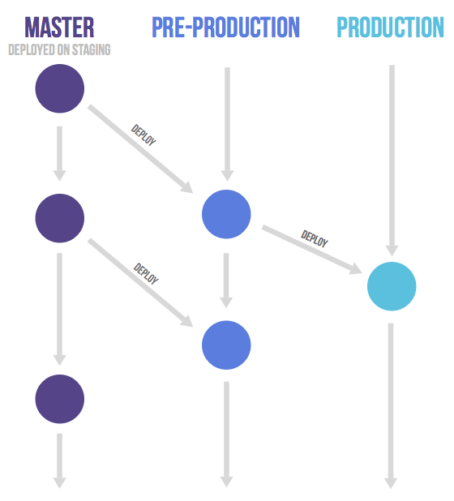

# Chapter 12 GitLab Flow로 환경 단계까지 표현하기

## 학습 목표

- **GitLab Flow**가 **GitHub Flow**와 비해 **배포·환경**을 어떻게 드러내는지 설명한다.
- **MR(Merge Request, 병합 요청)**가 GitHub의 PR과 같은 자리에 선다는 것을 말로 정리한다.

## 세부 주제

### 12-1 환경 브랜치와 배포 단계

- 스테이징·운영 등 단계를 브랜치로 고정

### 12-2 MR과 권한 패턴

- 같은 원격 vs 포크에서 MR

## 실습 체크리스트

- [Chapter 11](./11-github-flow.md)의 PR 흐름을 떠올리며, GitLab(또는 GitHub)에서 **환경 이름을 떠올릴 수 있는 브랜치 전략**을 팀에 말로 설명해 본다(실제 저장소는 선택).

## 본문

### 12-1 환경 브랜치와 배포 단계

**GitLab Flow**는 이름 그대로 GitLab에서 자주 이야기되는 패턴이지만, **“GitHub Flow + 환경을 브랜치로 표현”**에 가까운 팀도 많습니다. 예를 들어 `pre-production`, `production`처럼 **환경 이름이 붙은 브랜치**에서 배포를 맞춥니다. 환경마다 다른 설정·승인 단계를 **말로만** 넘기지 않고, **어느 브랜치가 어느 단계를 대표하는지** 고정하면 “스테이징에는 있는데 운영에는 없음” 같은 **배포 단계 누락**을 줄이기 쉽습니다.

**환경·단계**를 브랜치로 표현할 때의 흐름 개략은 아래와 같습니다(팀마다 브랜치 이름은 다를 수 있음).

| 패턴 | 설명 |
|------|------|
| GitHub Flow에 가깝게 | 빠른 배포, 그래프 단순 |
| 환경 브랜치를 둠 | 스테이징·운영 반영 순서를 브랜치 이름으로 공유 |

파이프라인(CI/CD)과 태그를 함께 쓰는 팀도 많습니다. 세 전략을 한 표로 비교하면 [Chapter 14](./14-branch-comparison-fork-team-pr.md)입니다.

---

### 12-2 MR과 권한 패턴

GitLab에서는 PR과 같은 역할을 **MR(Merge Request, 병합 요청)**이라고 부릅니다. **저장소에 쓰기 권한이 있으면** 같은 원격에 브랜치를 올리고 MR을 열고, **오픈소스처럼 쓰기 권한이 없으면** 포크에서 MR을 보내는 흐름은 GitHub와 같습니다. 위 도식에서 **기능 브랜치에서 상위 브랜치로 합치는 선**이 GitHub Flow의 PR과 같은 자리에 MR이 옵니다. 팀 내부에서는 **fork 없이** 브랜치 + MR만으로도 GitLab Flow를 운영하는 경우가 많습니다. 외부 기여가 늘면 [Chapter 14](./14-branch-comparison-fork-team-pr.md)의 포크·`upstream` 설명과 맞춰 읽으면 좋습니다.

**안 쓰면 생기기 쉬운 일**은 다음과 같습니다. 환경마다 다른 설정을 **문서 없이**만 전달하면 같은 실수가 반복됩니다. 브랜치·파이프라인·MR 규칙 중 최소 하나로 **단계를 고정**하는 것이 중요합니다.

연습문제:

1. 문제: “GitHub Flow만 쓰는 팀”과 “환경별 브랜치를 둔 GitLab Flow에 가까운 팀”의 차이를 **배포 단계 표현** 관점에서 한 문장으로 비교하세요.
2. 문제: MR과 PR의 관계를 한 문장으로 쓰세요(같은 자리의 다른 이름인지).

정답 포인트:

GitLab Flow에 가까운 팀은 **환경·단계**를 브랜치(또는 파이프라인)로 드러내는 비중이 큽니다. MR과 PR은 **같은 자리의 다른 이름**에 가깝고, 플랫폼 용어만 다릅니다.

---

[상위 문서로 돌아가기](./README.md)
