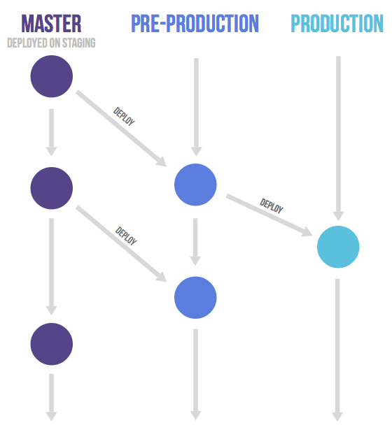

# Chapter 12 GitLab Flow로 환경 단계까지 표현하기

## 학습 목표

- **GitLab Flow**가 **GitHub Flow**와 비해 **배포·환경**을 어떻게 드러내는지 설명한다.
- **환경 브랜치** 사이에서 변경이 **어느 순서로 승격(병합)**되는지 단계로 말할 수 있다.
- **MR(Merge Request, 병합 요청)**가 GitHub의 PR과 같은 자리에 선다는 것을 말로 정리한다.

## 본문

### 12-1 환경 브랜치와 배포 단계

**GitLab Flow**는 이름 그대로 GitLab에서 자주 이야기되는 패턴이지만, **“GitHub Flow + 환경을 브랜치로 표현”**에 가까운 팀도 많습니다. 예를 들어 `pre-production`, `production`처럼 **환경 이름이 붙은 브랜치**에서 배포를 맞춥니다. 환경마다 다른 설정·승인 단계를 **말로만** 넘기지 않고, **어느 브랜치가 어느 단계를 대표하는지** 고정하면 “스테이징에는 있는데 운영에는 없음” 같은 **배포 단계 누락**을 줄이기 쉽습니다.

**환경·단계**를 브랜치로 표현할 때의 흐름은 보통 다음 순서를 따릅니다. 팀마다 브랜치 이름은 다를 수 있습니다.

1. **기능 브랜치**에서 작업하고, 검토가 끝나면 **통합 브랜치**(흔히 `main`)로 합칩니다.
2. 스테이징에 올릴 준비가 되면 `main`의 변경을 **`pre-production`**(또는 `staging`)으로 승격합니다.
3. 운영 배포 시점에 **`pre-production`**에서 검증된 커밋을 **`production`**으로 승격합니다.

아래 도식으로 브랜치와 병합 방향을 확인한 뒤, 바로 아래 **도식 해석**과 맞춰 읽어 보세요.

**도식 해석.** 왼쪽·아래에 가까운 짧은 가지는 **기능 작업**이고, 가운데·위쪽의 굵은 선은 **통합·환경 브랜치**입니다. 화살표·병합 선은 “기능 → 통합 → pre-production → production”처럼 **한 단계씩 승격**하는 방향을 나타냅니다. GitHub Flow가 `main` 하나에 바로 합치는 것과 달리, 여기서는 **환경 이름이 붙은 브랜치**가 배포 단계를 나눠 보여 줍니다.

| 패턴 | 설명 |
|------|------|
| GitHub Flow에 가깝게 | 빠른 배포, 그래프 단순 |
| 환경 브랜치를 둠 | 스테이징·운영 반영 순서를 브랜치 이름으로 공유 |

파이프라인(CI/CD)과 태그를 함께 쓰는 팀도 많습니다. 세 전략을 한 표로 비교하면 [Chapter 14](./14-branch-comparison-fork-team-pr.md)입니다.

---

### 12-2 MR과 권한 패턴

GitLab에서는 PR과 같은 역할을 **MR(Merge Request, 병합 요청)**이라고 부릅니다. **저장소에 쓰기 권한이 있으면** 같은 원격에 브랜치를 올리고, 대상 브랜치(예: `main` 또는 `pre-production`)를 지정해 MR을 엽니다. **오픈소스처럼 쓰기 권한이 없으면** 포크에서 브랜치를 만든 뒤 원본으로 MR을 보내는 흐름은 GitHub와 같습니다. 위 도식에서 **기능 브랜치에서 상위 브랜치로 합치는 선**이 GitHub Flow의 PR과 같은 자리에 MR이 옵니다. 팀 내부에서는 **fork 없이** 브랜치 + MR만으로도 GitLab Flow를 운영하는 경우가 많습니다. 외부 기여가 늘면 [Chapter 14](./14-branch-comparison-fork-team-pr.md)의 포크·`upstream` 설명과 맞춰 읽으면 좋습니다.

**안 쓰면 생기기 쉬운 일**은 다음과 같습니다. 환경마다 다른 설정을 **문서 없이**만 전달하면 같은 실수가 반복됩니다. 브랜치·파이프라인·MR 규칙 중 최소 하나로 **단계를 고정**하는 것이 중요합니다.

---

### 연습문제

1. 문제: “GitHub Flow만 쓰는 팀”과 “환경별 브랜치를 둔 GitLab Flow에 가까운 팀”의 차이를 **배포 단계 표현** 관점에서 한 문장으로 비교하세요.
   - 입력: 없음
   - 출력: 비교 문장 1개
   - 조건: “환경·브랜치” 또는 “배포 단계” 중 하나 이상을 문장에 포함할 것
2. 문제: 기능 작업이 끝난 뒤 `main` → `pre-production` → `production`으로 올리는 이유를, **검증 단계** 관점에서 한 문장으로 쓰세요.
   - 입력: 없음
   - 출력: 이유 문장 1개
   - 조건: “한 번에 production”이 아닌 **단계 승격**을 언급할 것
3. 문제: MR과 PR의 관계를 한 문장으로 쓰세요.
   - 입력: 없음
   - 출력: 관계 문장 1개
   - 조건: “같은 자리” 또는 “다른 이름”을 문장에 포함할 것

### 정답 포인트

GitLab Flow에 가까운 팀은 **환경·단계**를 브랜치(또는 파이프라인)로 드러내는 비중이 큽니다. `main`에서 바로 운영으로 넣지 않고 **pre-production에서 검증한 뒤 production으로 승격**하면 배포 누락·미검증 반영을 줄이기 쉽습니다. MR과 PR은 **같은 자리의 다른 이름**에 가깝고, 플랫폼 용어만 다릅니다.

---

[상위 문서로 돌아가기](./README.md)
