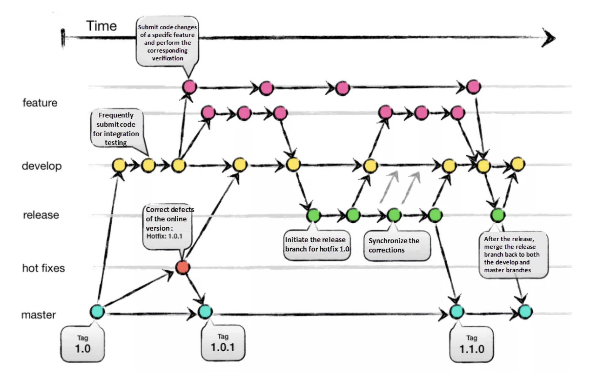

# Chapter 13 Git Flow로 릴리즈와 핫픽스 분리하기

## 학습 목표

- **Git Flow**에서 `main`, `develop`, `feature`, `release`, `hotfix`가 각각 어떤 역할인지 말한다.
- **매일 배포하는 서비스**와 **주기적 버전 릴리즈 제품** 중 어디에 Git Flow가 잘 맞는지 구분한다.

## 세부 주제

### 13-1 브랜치 종류와 역할

- develop·feature·release·hotfix

### 13-2 도입 시 고려할 점

- 브랜치 수와 운영 부담

## 실습 체크리스트

- 종이나 다이어그램으로 **Git Flow 브랜치 다섯 종류**를 그린 뒤, 자신이 만든 프로젝트에 **전부 필요한지** 질문해 본다.
- [Chapter 8](./08-cli-branch.md)의 브랜치 명령으로 **로컬에 `feature/연습` 하나**만 만들어 보아도 충분하다(전체 Git Flow를 실제로 구축할 필요는 없음).

## 본문

### 13-1 브랜치 종류와 역할

**Git Flow**는 `main`(또는 `master`) 외에 **`develop`**을 두어 **다음 릴리즈를 모으는 통합 브랜치**로 쓰고, **`feature/*`**, **`release/*`**, **`hotfix/*`**처럼 역할이 나뉜 **브랜치 모델**입니다. **릴리즈 주기가 길고**, 버전 번호·QA·핫픽스가 **명확히 구분**될 때 이 모델이 이해하기 쉽습니다. 역할 이름이 많으니, 먼저 **`develop`·`feature`·`release`·`hotfix`가 `main`과 어떻게 맞물리는지**를 도식으로 본 뒤 표로 정리합니다.

| 브랜치(예시) | 통상적인 역할 |
|--------------|----------------|
| `main` | 출시된 안정 버전 |
| `develop` | 다음 버전 개발 통합 |
| `feature/*` | 기능 단위 개발 |
| `release/*` | 출시 직전 버그 수정·문서 정리 |
| `hotfix/*` | 운영 중 긴급 수정 |

**안 쓰면 생기기 쉬운 일**(Git Flow가 잘 맞는 팀의 맥락)은 다음과 같습니다. 모두가 `main`에만 쌓으면 **출시 직전에만 발견되는 변경**이 섞이기 쉽고, 긴급 패치와 일상 개발이 **한 갈래에서 충돌**할 수 있습니다. Git Flow는 그 분리를 **규칙으로 박아 두는** 쪽에 가깝습니다.

---

### 13-2 도입 시 고려할 점

**매일 여러 번 배포**하는 SaaS에는 브랜치가 많아져 **관리·교육 비용**이 커질 수 있어, 팀은 [Chapter 11 GitHub Flow](./11-github-flow.md)만으로 가거나 Git Flow에서 **일부 브랜치 규칙만** 가져오는 경우가 많습니다. 반대로 설치형 소프트웨어·모바일 앱처럼 **버전 번호가 곧 배포 단위**인 제품에서는 Git Flow가 여전히 직관적인 선택지입니다.

연습문제:

1. 문제: `hotfix/*`가 **일상 기능 개발 `feature/*`**와 나뉘어 있으면 좋은 이유를 한 문장으로 쓰세요.
2. 문제: Git Flow 전체를 소규모 웹 서비스에 그대로 도입하면 생기기 쉬운 **운영 부담** 한 가지를 적으세요.

정답 포인트:

운영 장애·긴급 수정을 **출시 일정과 섞지 않고** 빠르게 수습·배포하기 위해 `hotfix`와 `feature`를 나눕니다. 브랜치·머지 규칙이 많아지면 **온보딩·일상 비용**이 커질 수 있어, 소규모 웹 서비스에 전 모델을 그대로 두기 부담스러울 수 있습니다.

---

[상위 문서로 돌아가기](./README.md)
