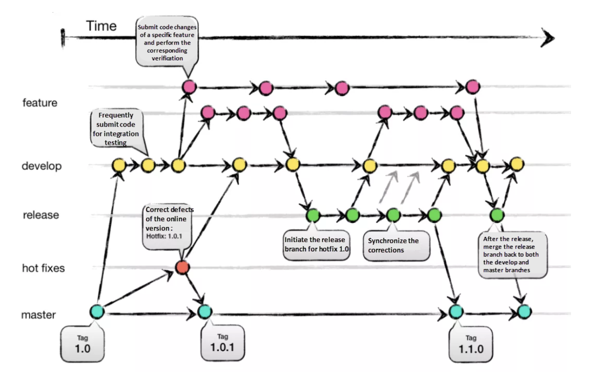

# Chapter 13 Git Flow로 릴리즈와 핫픽스 분리하기

## 학습 목표

- **Git Flow**에서 `main`, `develop`, `feature`, `release`, `hotfix`가 각각 어떤 역할인지 말한다.
- **릴리즈·핫픽스**가 `develop`·`main`과 어떻게 갈라지고 다시 합쳐지는지 단계로 설명할 수 있다.
- **매일 배포하는 서비스**와 **주기적 버전 릴리즈 제품** 중 어디에 Git Flow가 잘 맞는지 구분한다.

## 본문

### 13-1 브랜치 종류와 역할

**Git Flow**는 `main`(또는 `master`) 외에 **`develop`**을 두어 **다음 릴리즈를 모으는 통합 브랜치**로 쓰고, **`feature/*`**, **`release/*`**, **`hotfix/*`**처럼 역할이 나뉜 **브랜치 모델**입니다. **릴리즈 주기가 길고**, 버전 번호·QA·핫픽스가 **명확히 구분**될 때 이 모델이 이해하기 쉽습니다. 역할 이름이 많으니, 먼저 도식으로 맞물림을 본 뒤 표와 생명주기 단계로 정리합니다.

아래 도식을 보고, 바로 아래 **도식 해석**과 역할 표를 맞춰 읽어 보세요.

**도식 해석.** `develop`은 **다음 출시에 넣을 변경을 모으는 축**이고, `feature/*`는 그 축에서 짧게 갈라져 다시 `develop`으로 합쳐집니다. `release/*`는 출시 직전에 `develop`에서 갈라져 **버그 수정·문서 정리**만 한 뒤 `main`과 `develop` 양쪽으로 반영됩니다. `hotfix/*`는 **이미 출시된 `main`**에서 갈라져 긴급 수정을 넣고, 역시 `main`과 `develop`에 되돌려 **운영 패치와 개발 축이 어긋나지 않게** 합니다.

| 브랜치(예시) | 통상적인 역할 |
|--------------|----------------|
| `main` | 출시된 안정 버전 |
| `develop` | 다음 버전 개발 통합 |
| `feature/*` | 기능 단위 개발 |
| `release/*` | 출시 직전 버그 수정·문서 정리 |
| `hotfix/*` | 운영 중 긴급 수정 |

**릴리즈·핫픽스 생명주기**를 단계로 쓰면 다음과 같습니다.

1. **기능:** `develop`에서 `feature/*`를 만들고, 끝나면 `develop`으로 병합합니다.
2. **릴리즈:** 출시 준비가 되면 `develop`에서 `release/*`를 만들고, QA·문구 수정을 끝낸 뒤 `main`에 병합하며 버전 태그를 달고, 같은 수정을 `develop`에도 반영합니다.
3. **핫픽스:** 운영 장애 시 `main`에서 `hotfix/*`를 만들고, 수정 후 `main`에 병합·태그한 뒤 `develop`에도 병합해 이후 릴리즈에 빠지지 않게 합니다.

**안 쓰면 생기기 쉬운 일**(Git Flow가 잘 맞는 팀의 맥락)은 다음과 같습니다. 모두가 `main`에만 쌓으면 **출시 직전에만 발견되는 변경**이 섞이기 쉽고, 긴급 패치와 일상 개발이 **한 갈래에서 충돌**할 수 있습니다. Git Flow는 그 분리를 **규칙으로 박아 두는** 쪽에 가깝습니다.

---

### 13-2 도입 시 고려할 점

**매일 여러 번 배포**하는 SaaS에는 브랜치가 많아져 **관리·교육 비용**이 커질 수 있어, 팀은 [Chapter 11 GitHub Flow](./11-github-flow.md)만으로 가거나 Git Flow에서 **일부 브랜치 규칙만** 가져오는 경우가 많습니다. 반대로 설치형 소프트웨어·모바일 앱처럼 **버전 번호가 곧 배포 단위**인 제품에서는 Git Flow가 여전히 직관적인 선택지입니다.

판정할 때 한 줄로 기억하면 됩니다. **배포가 잦고 역할 브랜치를 유지할 인력이 적으면** GitHub Flow 쪽이 부담이 적고, **출시 일정·버전·핫픽스가 문서처럼 나뉘어야 하면** Git Flow가 잘 맞습니다. 세 전략을 표로 고르려면 [Chapter 14](./14-branch-comparison-fork-team-pr.md)로 이어가면 됩니다.

---

### 연습문제

1. 문제: `hotfix/*`가 **일상 기능 개발 `feature/*`**와 나뉘어 있으면 좋은 이유를 한 문장으로 쓰세요.
   - 입력: 없음
   - 출력: 이유 문장 1개
   - 조건: “긴급” 또는 “운영”과 “출시/기능 일정” 분리를 문장에 포함할 것
2. 문제: `release/*`를 끝낸 뒤 **`main`과 `develop` 양쪽에** 반영하는 이유를 한 문장으로 쓰세요.
   - 입력: 없음
   - 출력: 이유 문장 1개
   - 조건: 출시본과 다음 개발 축이 **어긋나지 않게** 한다는 뜻을 포함할 것
3. 문제: Git Flow 전체를 소규모 웹 서비스에 그대로 도입하면 생기기 쉬운 **운영 부담** 한 가지를 적으세요.
   - 입력: 없음
   - 출력: 부담 한 가지(한 문장)
   - 조건: 브랜치 수·규칙·온보딩 중 하나 이상을 언급할 것

### 정답 포인트

운영 장애·긴급 수정을 **출시 일정과 섞지 않고** 빠르게 수습·배포하기 위해 `hotfix`와 `feature`를 나눕니다. `release` 수정은 `main`에만 넣으면 `develop`이 뒤처지므로 **양쪽 반영**이 필요합니다. 브랜치·병합 규칙이 많아지면 **온보딩·일상 비용**이 커질 수 있어, 소규모 웹 서비스에 전 모델을 그대로 두기 부담스러울 수 있습니다.

---

[상위 문서로 돌아가기](./README.md)
