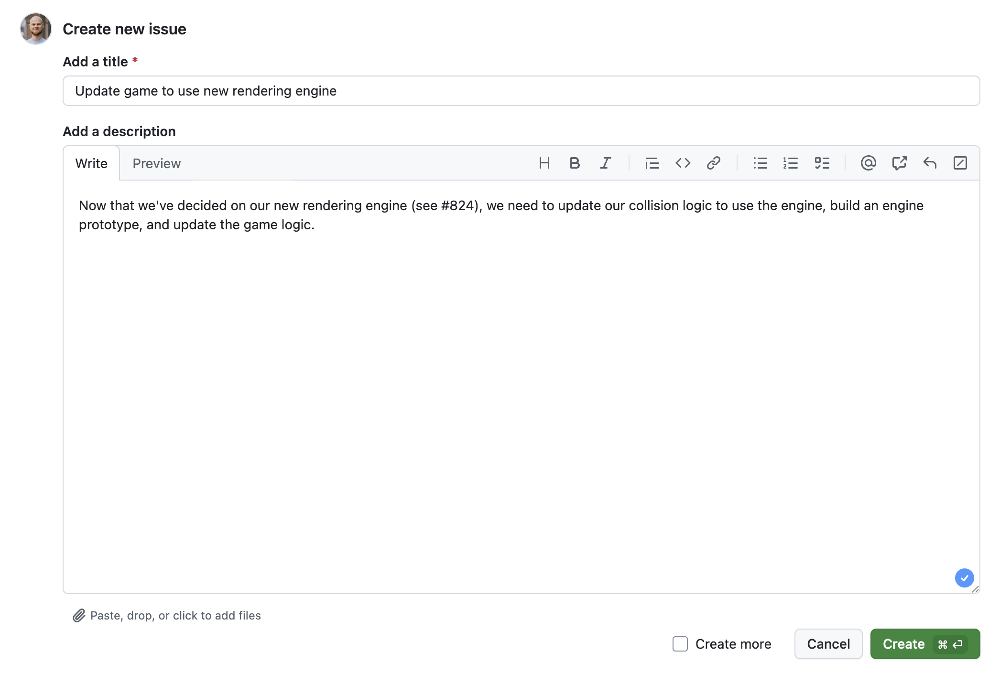
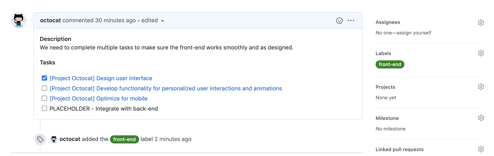
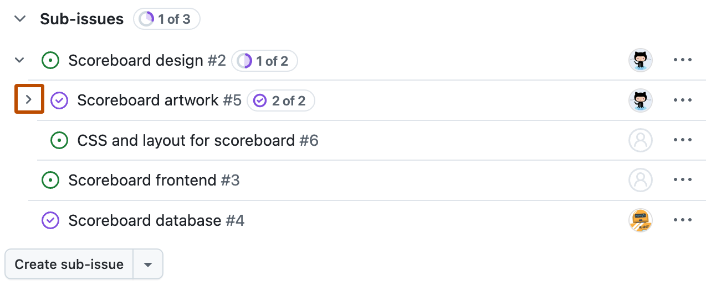
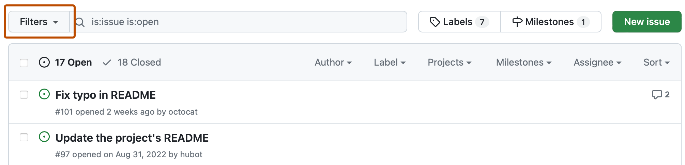

# Chapter 15 GitHub Issues로 작업을 기록하고 추적하기

## 학습 목표

- **이슈(issue)**를 작업 단위로 만들고, 제목·본문·메타데이터를 어떻게 채워야 재사용 가능한 기록이 되는지 설명한다.
- **라벨(label)**, **담당자(assignee)**, **이슈 유형(type)**, **필드(field)**를 사용해 이슈를 분류하는 이유를 말할 수 있다.
- **하위 이슈(sub-issue)**, **이슈 종속성(dependency)**, **PR 연결**을 통해 작업 관계를 표현하고 추적하는 흐름을 설명한다.

## 본문

### 15-1 이슈를 만드는 이유와 기본 작성법

**이슈(issue)**는 저장소 안에서 할 일, 버그, 개선 아이디어를 **번호가 붙은 작업 단위**로 남기는 기능입니다. 채팅 메시지와 달리 제목·본문·상태 변경·댓글이 시간순으로 누적되기 때문에, 나중에 "왜 이렇게 결정했는가"를 추적하기 쉽습니다. 코드 변경 자체는 PR에서 이루어지더라도, 작업의 맥락은 보통 이슈에서 시작합니다.

리포지토리 상단의 Issues 탭에서 이슈를 만듭니다. 초급 단계에서는 먼저 **제목 품질**을 잡는 것이 가장 중요합니다. "버그 있음"처럼 모호한 제목보다 "회원가입 버튼 클릭 시 500 오류"처럼 조건과 증상이 보이는 제목이 좋습니다. 아래 화면에서 Issues 탭 위치를 확인한 뒤 **화면 해석**을 읽습니다.

**화면 해석.** 저장소 상단 메뉴에서 **Issues**를 누르면 이 저장소의 이슈 목록·새 이슈 만들기로 들어갑니다. Code·Pull requests와 형제 탭이므로, 작업 기록은 여기서 시작하는 습관을 들이면 됩니다.

이슈 본문에는 최소한 "문제/목표", "현재 상태", "기대 결과"를 분리해서 적어야 팀원이 바로 움직일 수 있습니다. 버그 이슈라면 재현 순서와 실행 환경을 넣고, 기능 이슈라면 **완료 기준**을 짧게라도 넣는 편이 좋습니다. 완료 기준은 “이 조건이 만족되면 이슈를 닫아도 된다”는 **수용 기준**입니다. 아래 작성 화면 예시를 보고 **화면 해석**과 맞춰 보세요.

**화면 해석.** 위쪽 **Title**에 조건·증상이 보이게 쓰고, 본문에는 문제·현재·기대를 구역으로 나눕니다. 제목만 길고 본문이 비어 있으면 나중에 같은 이슈를 다시 열어도 맥락이 복원되지 않습니다.

---

### 15-2 라벨·담당자·유형·필드로 분류하기

이슈를 많이 만들수록 **메타데이터**가 없으면 목록이 금방 섞입니다. 여기서 메타데이터는 이슈에 붙이는 **분류·책임·추가 값**을 말합니다. 그래서 라벨, 담당자, 이슈 유형, 사용자 정의 필드를 함께 씁니다.  
라벨은 성격(`bug`, `feature`)을, 담당자는 책임 주체를, 유형은 조직 기준 분류(예: Task/Bug/Feature)를, 필드는 우선순위·목표일 같은 구조화 정보를 담당합니다. 아래 표로 역할을 나란히 본 뒤 **표 해석**을 읽습니다.

| 항목 | 질문 | 예시 |
|------|------|------|
| 라벨 | "무슨 종류 작업인가?" | `bug`, `docs`, `help wanted` |
| 담당자 | "누가 소유하고 있나?" | `@me`, 팀원 |
| 유형 | "조직 기준으로 어떤 카테고리인가?" | `Bug`, `Task`, `Feature` |
| 필드 | "추가로 어떤 값을 추적할까?" | `priority=high`, `target date` |

**표 해석.** 네 항목은 서로 대체 관계가 아니라 **겹쳐 쓰는 축**입니다. 같은 버그라도 라벨로 종류를, 담당자로 소유자를, 필드로 우선순위를 같이 두면 목록에서 “누가, 무엇을, 얼마나 급한지”를 한 번에 읽기 쉽습니다.

라벨과 담당자를 붙이면 이슈 목록에서 빠르게 필터링할 수 있고, 같은 작업군을 한 번에 찾기 쉬워집니다. 이 단계가 빠지면 이슈는 남아도 "누가, 무엇을, 언제"를 한 화면에서 읽기 어렵습니다. 라벨이 붙은 화면 예시를 확인합니다.

**화면 해석.** 이슈 옆·상세의 라벨 영역에서 `bug` 같은 값을 고르면, 목록·필터에서 그 이슈를 **종류 기준**으로 묶을 수 있습니다. 라벨 없이 제목만 다르면 검색·필터 비용이 커집니다.

---

### 15-3 하위 이슈·종속성·브랜치·PR 연결

큰 작업을 한 개 이슈로만 두면 진행률이 뭉뚱그려져서 막힌 지점이 잘 안 보입니다. 이럴 때 **하위 이슈(sub-issue)**로 쪼개면, 상위 이슈 하나 아래에 세부 작업을 계층으로 달 수 있어 누가 무엇에서 막혔는지 명확해집니다. 아래 펼침 예시를 보고 **화면 해석**을 읽습니다.

**화면 해석.** 상위 이슈 안에서 하위 이슈 목록을 펼치면 **세부 완료 단위**가 보입니다. 상위만 열려 있고 하위가 막혀 있으면, 진행률이 멈춘 지점을 제목만으로 추측하지 않아도 됩니다.

서로 의존하는 작업은 **이슈 종속성(dependency)**으로 "무엇이 무엇을 막는가"를 표시합니다. 또한 이슈에서 브랜치를 만들고 PR을 연결하면, 실제 코드 변경과 작업 기록이 이어집니다. 특히 PR 설명에 `Closes #번호` 같은 닫힘 키워드를 쓰면 기본 브랜치에 병합될 때 이슈를 자동으로 닫을 수 있습니다.

**절차 해석.** 큰 일 → **하위 이슈로 쪼개기** → 막히는 관계는 **종속성**으로 표시 → 구현은 브랜치·PR로 연결 → 본문에 `Closes #번호`를 두면 병합 시 이슈가 닫힙니다. 이슈만 닫고 PR이 없거나, PR만 있고 이슈 맥락이 없으면 추적이 끊깁니다.

---

### 15-4 필터·검색·대시보드로 추적하기

이슈 수가 늘어나면 "열려 있는 버그만", "내가 담당한 항목만", "특정 라벨만" 같은 뷰가 필요합니다. GitHub 이슈 목록에서는 기본 필터 메뉴와 검색 질의를 함께 사용할 수 있습니다. 예를 들어 `is:open label:bug assignee:@me` 같은 형태로 좁혀 볼 수 있습니다. 필터 메뉴 위치를 화면에서 확인합니다.

**화면 해석.** 목록 상단 필터·검색 칸에서 상태·작성자·라벨·담당자를 고르거나, 같은 조건을 **검색 질의 한 줄**로 적을 수 있습니다. 반복하는 조건은 저장해 두면 매번 다시 짜지 않아도 됩니다.

개인 대시보드의 Issues/PR 뷰를 함께 쓰면 여러 저장소에 흩어진 할 일을 모아서 볼 수 있습니다. 저장된 보기(saved view)를 만들어 반복 쿼리를 고정해 두면 운영 비용을 크게 줄일 수 있습니다. 이슈를 **기간·버전 묶음**으로 관리하는 방법은 [Chapter 16](./16-github-milestones.md), 보드·테이블로 흐름을 보는 방법은 [Chapter 17](./17-github-projects.md)에서 이어집니다.

---

### 연습문제

1. 문제: 기능 이슈를 하나 가정하고, 제목 1줄과 본문에 들어갈 완료 기준 2가지를 작성하세요.
   - 입력: 없음(가상의 기능 하나를 스스로 정함)
   - 출력: 제목 1줄 + 완료 기준 2줄
   - 조건: 제목에 대상·동작이 보이게 할 것. 완료 기준은 “닫아도 되는 조건”으로 쓸 것
2. 문제: "로그인 오류" 상위 이슈를 하위 이슈 3개로 나눈다면 어떤 단위로 쪼갤지 적으세요.
   - 입력: 없음
   - 출력: 하위 이슈 제목 3개
   - 조건: 서로 **독립 완료** 가능한 단위로 나눌 것
3. 문제: 본인에게 할당된 열린 버그만 보기 위한 필터 질의를 한 줄로 작성하세요.
   - 입력: 없음
   - 출력: 검색 질의 1줄
   - 조건: 열림·이슈·버그 라벨·담당자 `@me`를 모두 반영할 것

### 정답 포인트

좋은 이슈 제목은 조건·대상을 포함해 범위를 좁힙니다. 하위 이슈는 화면/UI, 서버/API, 테스트처럼 독립 완료 가능한 단위로 쪼개는 것이 좋습니다. 필터 질의는 `is:open is:issue label:bug assignee:@me`처럼 상태·종류·라벨·담당자를 함께 쓰면 됩니다.

---

[상위 문서로 돌아가기](./README.md)
