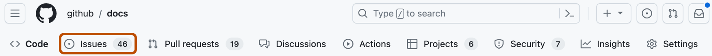

# Chapter 16 GitHub Milestones로 작업 묶음과 기한 관리하기

## 학습 목표

- **마일스톤(milestone)**이 이슈·PR을 어떤 기준으로 묶는지 설명할 수 있다.
- 마일스톤의 제목·설명·기한을 팀 운영 관점에서 어떻게 정하는지 말할 수 있다.
- 마일스톤 진행률을 읽고, 우선순위와 범위를 조정하는 기본 흐름을 설명할 수 있다.

## 세부 주제

- 마일스톤의 역할과 적용 시점
- 마일스톤 생성·연결·수정 절차
- 진행률 해석과 우선순위 조정
- 마일스톤 운영 시 자주 하는 실수

## 실습 체크리스트

- 학습용 저장소에서 `v0.1` 또는 `Sprint-1` 마일스톤을 하나 만든다.
- 이슈 3개 이상을 마일스톤에 연결하고, 우선순위 순서로 정렬해 본다.
- 이슈를 1개 이상 닫은 뒤 마일스톤 진행률이 어떻게 바뀌는지 확인한다.

## 본문

### 16-1 마일스톤은 무엇을 해결하나

이슈만 많이 쌓이면 "이번 릴리즈 범위가 어디까지인가"가 흐려지기 쉽습니다.  
**마일스톤**은 이슈와 PR을 버전, 스프린트, 목표 날짜 같은 기준으로 묶어서, 작업 단위를 **기간 단위 목표**로 바꿔 주는 기능입니다.

예를 들어 `v1.0` 마일스톤에 로그인, 회원가입, 비밀번호 재설정 이슈를 묶으면 팀은 "v1.0에 무엇이 포함되는가"를 한 화면에서 공유할 수 있습니다. 이때 마일스톤 진행률은 연결된 항목의 열림/닫힘 상태를 기반으로 계산되므로, 완료율을 경영/기획과 소통할 때도 기준점이 됩니다.

---

### 16-2 마일스톤 만들기와 연결하기

일반적으로 저장소의 Issues 또는 Pull requests 화면에서 **Milestones**로 이동해 새 마일스톤을 만듭니다.  
제목은 `v1.2.0`, `Sprint 07`처럼 시간/버전 축이 보이게 짓고, 설명에는 범위와 제외 범위를 짧게 적는 것이 좋습니다. 기한은 팀 합의 일정과 맞추되, 너무 멀리 잡으면 진행률 신뢰도가 떨어질 수 있습니다.

마일스톤을 만들었다면 이슈/PR 목록에서 항목을 선택해 일괄 연결할 수 있습니다. 이 과정을 습관화하면 "작업은 있는데 어느 릴리즈 소속인지 모름" 같은 상태를 줄일 수 있습니다.

---

### 16-3 진행률을 읽고 우선순위를 조정하기

마일스톤 화면에서는 완료율, 열린 항목 수, 닫힌 항목 수를 함께 확인합니다. 숫자만 볼 게 아니라, 남은 항목이 **핵심 경로인지 보조 작업인지**를 분리해서 보는 것이 중요합니다. 마감이 임박했는데 핵심 항목이 열려 있으면 범위 조정이나 일정 조정이 필요합니다.

마일스톤 안의 미해결 항목은 우선순위를 재정렬할 수 있습니다. 이때 "작업 난이도"와 "릴리즈 영향도"를 같이 봐야 실전에서 유효한 순서가 됩니다. 단순히 작성 순서대로 처리하면 중요한 결함이 뒤로 밀릴 수 있습니다.

---

### 16-4 자주 하는 실수와 방지 기준

마일스톤 운영에서 자주 생기는 문제는 다음과 같습니다.

| 실수 | 발생 조건 | 영향 | 방지 기준 |
|------|-----------|------|-----------|
| 마일스톤 제목이 모호함 | `이번 주 작업` 같은 이름 사용 | 기간/버전 추적 실패 | 버전/스프린트 표기 강제 |
| 이슈 연결 누락 | 이슈 생성 시 메타데이터 생략 | 진행률 왜곡 | 이슈 생성 체크리스트에 마일스톤 포함 |
| 종료 기준 불명확 | 닫힘 조건 합의 없음 | 완료율 신뢰 하락 | 완료 정의(DoD) 문장화 |

마일스톤은 도구 자체보다 **운영 규칙의 일관성**이 성패를 가릅니다. 팀이 합의한 이름 규칙, 연결 시점, 종료 기준을 짧게 문서화해 두면 유지 비용이 크게 줄어듭니다.

---

연습문제:

1. 문제: `Sprint-3` 마일스톤 설명에 꼭 들어가야 할 정보 2가지를 쓰세요.
2. 문제: 마일스톤 완료율이 높아도 실제 출시 위험이 남을 수 있는 상황을 한 가지 적으세요.
3. 문제: 새 이슈 생성 시 마일스톤 누락을 줄이기 위한 팀 규칙을 한 줄로 제안하세요.

정답 포인트:

마일스톤 설명에는 목표 범위와 기한(또는 버전)을 포함하는 것이 기본입니다. 완료율이 높아도 핵심 결함 이슈가 열려 있으면 출시 위험은 여전히 큽니다. 이슈 템플릿 또는 생성 체크리스트에 마일스톤 지정 항목을 넣으면 누락을 줄일 수 있습니다.

---

[상위 문서로 돌아가기](./README.md)
