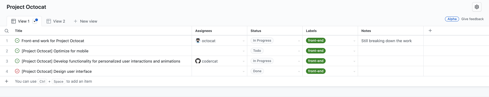
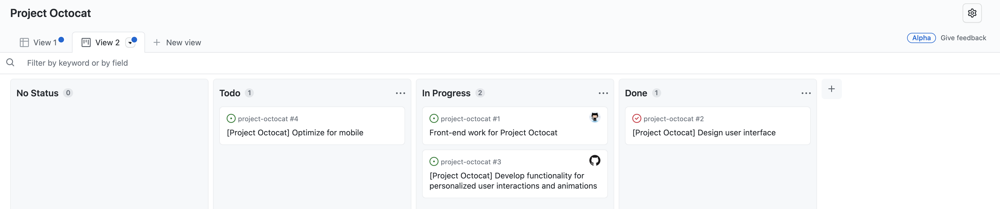
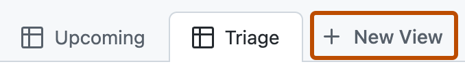
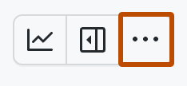

# Chapter 17 GitHub Projects로 작업 흐름 시각화하기

## 학습 목표

- **Projects**가 이슈/PR 목록과 어떻게 연결되어 추적 도구로 동작하는지 설명할 수 있다.
- Table·Board·Roadmap 레이아웃의 용도를 구분할 수 있다.
- 필드·뷰·워크플로 자동화를 사용해 프로젝트 운영 기본 틀을 만들 수 있다.

## 세부 주제

- Projects의 목적과 기본 구조
- Table/Board/Roadmap 뷰 운영 기준
- 사용자 정의 필드와 필터링
- 기본 자동화와 상태 관리

## 실습 체크리스트

- 학습용 저장소(또는 개인/조직 프로젝트)에서 새 프로젝트를 하나 생성한다.
- 이슈 3개 이상을 추가하고 `Status`, `Priority` 필드를 설정한다.
- Board 뷰에서 카드 이동으로 상태를 바꾸고, 저장된 뷰를 하나 만든다.

## 본문

### 17-1 Projects는 왜 필요한가

이슈 목록은 기록에는 강하지만, 여러 작업의 흐름을 한눈에 보기에는 한계가 있습니다.  
**Projects**는 이슈/PR을 항목(item)으로 모아서, 테이블·보드·로드맵 형태로 같은 데이터를 다른 관점에서 보여 줍니다. 그래서 팀은 "현재 병목이 어디인지", "다음 주 우선순위가 무엇인지"를 더 빠르게 판단할 수 있습니다.

Projects는 단순 시각화 도구가 아니라 작업 메타데이터를 관리하는 허브에 가깝습니다. 프로젝트에서 상태·담당자·우선순위를 바꾸면 이슈/PR과 동기화되는 구조를 활용하면, 운영 문서와 실제 작업 상태의 괴리를 줄일 수 있습니다.

---

### 17-2 레이아웃 선택: Table, Board, Roadmap

레이아웃은 "무엇을 보고 싶은가"에 따라 고릅니다.

| 레이아웃 | 적합한 질문 | 주 용도 |
|----------|-------------|---------|
| Table | "전체 항목을 속성 기준으로 정렬/필터할 수 있나?" | 백로그 정리, 대량 편집 |
| Board | "현재 단계별 작업량이 균형적인가?" | 칸반 운영, 일일 스탠드업 |
| Roadmap | "시간축으로 언제 끝나는가?" | 릴리즈/분기 계획 |

보통 초급 팀은 Board부터 시작해 상태 흐름을 맞추고, 이후 Table에서 우선순위·추정치 필드를 다듬는 방식이 안정적입니다.

---

### 17-3 필드와 저장된 뷰로 운영 기준 만들기

프로젝트 품질은 항목 수보다 **필드 설계**에서 갈립니다.  
`Status`, `Priority`, `Estimate`, `Target date`처럼 의사결정에 직접 쓰이는 필드를 먼저 정하고, 팀이 실제로 입력 가능한 최소 개수만 유지하는 것이 좋습니다.

뷰(View)는 단순 화면 구성이 아니라 팀의 질문을 고정하는 장치입니다. 예를 들어 "이번 스프린트 진행 중 항목" 뷰를 저장하면 매번 같은 필터를 반복 입력하지 않아도 되고, 회의 때 같은 기준을 공유할 수 있습니다.

---

### 17-4 기본 자동화로 수작업 줄이기

Projects에는 항목 추가 시 상태를 자동으로 `Todo`로 지정하거나, 조건에 맞는 이슈를 자동 추가하는 워크플로가 있습니다. 자동화를 잘 쓰면 보드 정리 시간은 줄고, 상태 누락으로 인한 커뮤니케이션 비용도 낮아집니다.

다만 자동화 규칙을 과하게 늘리면 팀원이 왜 상태가 바뀌었는지 이해하지 못해 오히려 혼란이 커질 수 있습니다. 처음에는 "자동 추가 1개 + 상태 기본값 1개" 정도로 시작해 안정화된 뒤 확장하는 편이 안전합니다.

---

연습문제:

1. 문제: Board와 Table 중 주간 스탠드업에 먼저 보여 줄 뷰를 고르고 이유를 한 문장으로 쓰세요.
2. 문제: `Priority` 필드 옵션을 3단계로 설계한다면 어떤 값으로 둘지 적으세요.
3. 문제: 자동화 규칙을 하나만 도입한다면 어떤 규칙을 먼저 둘지 쓰고, 기대 효과를 한 줄로 설명하세요.

정답 포인트:

스탠드업은 단계별 병목 확인이 중요해 Board가 직관적인 경우가 많습니다. 우선순위는 `High/Medium/Low`처럼 단순한 3단계가 유지보수에 유리합니다. 첫 자동화는 "새 항목 상태를 Todo로 설정"처럼 오류 가능성이 낮은 규칙이 좋습니다.

---

[상위 문서로 돌아가기](./README.md)
