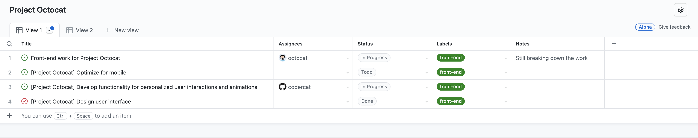
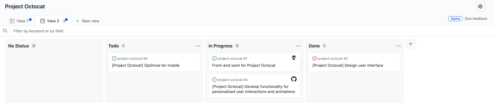
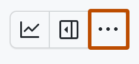

# Chapter 17 GitHub Projects로 작업 흐름 시각화하기

## 학습 목표

- **Projects**가 이슈/PR 목록과 어떻게 연결되어 추적 도구로 동작하는지 설명할 수 있다.
- Table·Board·Roadmap 레이아웃의 용도를 구분할 수 있다.
- 필드·뷰·워크플로 자동화를 사용해 프로젝트 운영 기본 틀을 만들 수 있다.

## 본문

### 17-1 Projects는 왜 필요한가

이슈 목록은 기록에는 강하지만, 여러 작업의 흐름을 한눈에 보기에는 한계가 있습니다.  
**Projects**는 이슈/PR을 항목(item)으로 모아서, 테이블·보드·로드맵 형태로 같은 데이터를 다른 관점에서 보여 줍니다. 그래서 팀은 "현재 병목이 어디인지", "다음 주 우선순위가 무엇인지"를 더 빠르게 판단할 수 있습니다.

Projects는 단순 시각화 도구가 아니라 작업 메타데이터를 관리하는 허브에 가깝습니다. 프로젝트에서 상태·담당자·우선순위를 바꾸면 이슈/PR과 동기화되는 구조를 활용하면, 운영 문서와 실제 작업 상태와의 괴리를 줄일 수 있습니다. 이슈 한 건의 작성·필터는 [Chapter 15](./15-github-issues.md), 기한·버전 묶음은 [Chapter 16](./16-github-milestones.md)에서 다루었고, 이 장은 **같은 작업을 흐름 화면으로 운영**하는 층입니다.

---

### 17-2 레이아웃 선택: Table, Board, Roadmap

레이아웃은 "무엇을 보고 싶은가"에 따라 고릅니다. 아래 표를 읽은 뒤 **표 해석**과 맞춰 보세요.

| 레이아웃 | 적합한 질문 | 주 용도 |
|----------|-------------|---------|
| Table | "전체 항목을 속성 기준으로 정렬/필터할 수 있나?" | 백로그 정리, 대량 편집 |
| Board | "현재 단계별 작업량이 균형적인가?" | 칸반 운영, 일일 스탠드업 |
| Roadmap | "시간축으로 언제 끝나는가?" | 릴리즈/분기 계획 |

**표 해석.** 같은 항목이라도 **질문이 바뀌면 레이아웃을 바꿉니다.** 스탠드업처럼 단계 병목이 궁금하면 Board, 필드 값을 한꺼번에 고치려면 Table, 일정 막대가 필요하면 Roadmap을 고르는 식입니다.

보통 초급 팀은 Board부터 시작해 상태 흐름을 맞추고, 이후 Table에서 우선순위·추정치 필드를 다듬는 방식이 안정적입니다. Table·Board 화면 예시를 각각 확인합니다.

**화면 해석.** Table은 행·열로 **속성 값**을 나란히 보여 줍니다. 우선순위·상태·담당자를 열로 두고 정렬·필터하면 백로그를 빠르게 다듬을 수 있습니다.

**화면 해석.** Board는 열마다 **상태 단계**를 두고 카드를 옮깁니다. 한 열에만 카드가 쌓이면 그 단계가 병목이라는 신호가 됩니다.

---

### 17-3 필드와 저장된 뷰로 운영 기준 만들기

프로젝트 품질은 항목 수보다 **필드 설계**에서 갈립니다.  
`Status`, `Priority`, `Estimate`, `Target date`처럼 의사결정에 직접 쓰이는 필드를 먼저 정하고, 팀이 실제로 입력 가능한 최소 개수만 유지하는 것이 좋습니다.

뷰(View)는 단순 화면 구성이 아니라 팀의 질문을 고정하는 장치입니다. 예를 들어 "이번 스프린트 진행 중 항목" 뷰를 저장하면 매번 같은 필터를 반복 입력하지 않아도 되고, 회의 때 같은 기준을 공유할 수 있습니다. 새 뷰를 추가하는 위치를 화면에서 확인한 뒤 **화면 해석**을 읽습니다.

**화면 해석.** 뷰를 추가·저장하면 **필터·레이아웃·보이는 필드**가 한 세트로 고정됩니다. 회의마다 필터를 다시 짜지 않아도, 같은 이름 뷰를 열어 같은 질문을 반복할 수 있습니다.

**절차 해석.** **최소 필드 정하기** → Board/Table 중 운영 뷰 만들기 → 자주 쓰는 필터를 **저장 뷰**로 남기기 순서가 입문에 안전합니다. 필드를 처음부터 많이 만들면 입력이 비어 뷰 신뢰도가 떨어집니다.

---

### 17-4 기본 자동화로 수작업 줄이기

Projects에는 항목 추가 시 상태를 자동으로 `Todo`로 지정하거나, 조건에 맞는 이슈를 자동 추가하는 워크플로가 있습니다. 자동화를 잘 쓰면 보드 정리 시간은 줄고, 상태 누락으로 인한 커뮤니케이션 비용도 낮아집니다.

다만 자동화 규칙을 과하게 쌓으면 팀원이 왜 상태가 바뀌었는지 이해하지 못해 오히려 혼란이 커질 수 있습니다. 처음에는 "자동 추가 1개 + 상태 기본값 1개" 정도로 시작해 안정화된 뒤 확장하는 편이 안전합니다. 메뉴에서 워크플로·설정 진입 위치를 확인합니다.

**화면 해석.** 프로젝트 메뉴에서 워크플로·설정으로 들어가면 **항목이 들어올 때·상태가 바뀔 때** 자동으로 할 일을 고를 수 있습니다. 메뉴 위치를 알아 두면, 보드만 만지다 자동화 진입점을 못 찾는 일을 줄입니다.

**절차 해석.** 첫 자동화는 **새 항목 상태를 `Todo`로 두기**처럼 실패해도 피해가 작은 규칙 하나만 켭니다. 동작이 팀 공통 언어가 된 뒤에 자동 추가·상태 전이 규칙을 늘웁니다.

---

### 연습문제

1. 문제: Board와 Table 중 주간 스탠드업에 먼저 보여 줄 뷰를 고르고 이유를 한 문장으로 쓰세요.
   - 입력: 없음
   - 출력: 선택 1개 + 이유 문장 1개
   - 조건: 단계·병목 중 하나를 이유에 포함할 것
2. 문제: `Priority` 필드 옵션을 3단계로 설계한다면 어떤 값으로 둘지 적으세요.
   - 입력: 없음
   - 출력: 값 3개
   - 조건: 팀이 매일 고를 수 있을 만큼 단순할 것
3. 문제: 자동화 규칙을 하나만 도입한다면 어떤 규칙을 먼저 둘지 쓰고, 기대 효과를 한 줄로 설명하세요.
   - 입력: 없음
   - 출력: 규칙 1개 + 효과 1줄
   - 조건: “상태 기본값” 또는 “자동 추가”처럼 오류 가능성이 낮은 쪽을 고를 것

### 정답 포인트

스탠드업은 단계별 병목 확인이 중요해 Board가 직관적인 경우가 많습니다. 우선순위는 `High` / `Medium` / `Low`처럼 단순한 3단계가 유지보수에 유리합니다. 첫 자동화는 "새 항목 상태를 Todo로 설정"처럼 오류 가능성이 낮은 규칙이 좋습니다.

---

[상위 문서로 돌아가기](./README.md)
